# Guessify

### This is the backend repository for the "Guessify" web project.
Guessify is a Spotify based web game that tests how well you know your own songs and playlists! 
Below you'll find a brief API documentation, and a diagram of the project's architecture. 

*The project is in progress*

## Architecture - State Diagram

## Open Endpoints

Login endpoint - redirects to Spotify's authentication API.

* Login : `POST /api/login/`

## Endpoints that require Authentication

Closed endpoints require a valid Token to be included in the header of the
request. 
A Token is acquired from the Login view above.

*Authentication will be implemented in the future - currently all endpoints below are open*

### User related
API endpoints for all users and specific user

* [Show All Users](./documentation/users.md) : `GET /api/users`
* [Show Specific User By ID](./documentation/users.md) : `GET /api/users/:id`

### Playlist related

Endpoint for all fetched playlist and get a specific playlist by id
* [Show All Playlists](./documentation/playlists.md) : `GET /api/playlists/`
* [Show Playlist By ID](./documentation/playlists.md) : `GET /api/playlists/:id`

